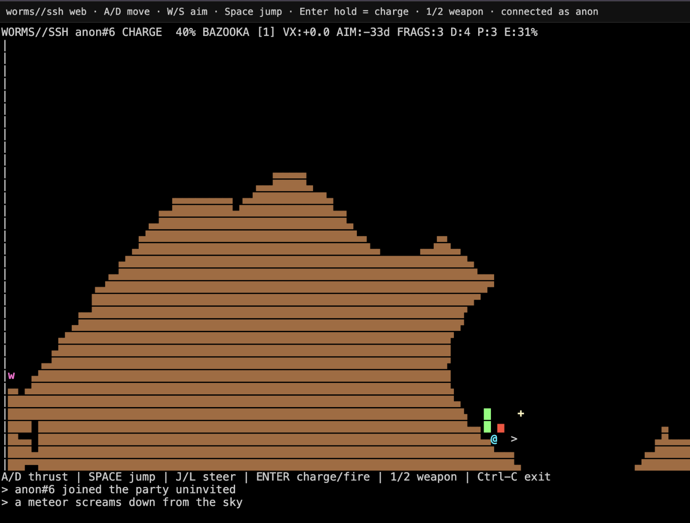

# earthworms//ssh



A text-based artillery game, in the spirit of the classic Worms by Team17, but everything happens inside an SSH session or a single browser tab. No accounts, no goals, no leaderboards that matter, no point. Just blow up other people's pixels for a few minutes.

> This is an unaffiliated, non-commercial fan tribute. The Worms franchise is © Team17 Group plc. No assets, sprites, sounds, level data, or trademarks are used here — only the artillery-game-with-worms concept that a couple of decades of arena shooters have made common vocabulary. If a Team17 lawyer wants this taken down, open an issue and it goes.

## Try it

Browser: **<https://ews.private.systems>**

SSH:

```sh
ssh -p 1025 <yourname>@ews.private.systems
```

Either route drops you into the same shared world. Authentication accepts `none`, the username you typed becomes the name floating over your worm, and you are dropped into the same shared world as everyone else currently connected. Quit with `Ctrl-C`. Be nice. Or don't.

The server tries to give you the best output your terminal can handle: truecolor if `COLORTERM=truecolor`, otherwise 256, then 16, then monochrome for `TERM=dumb`. On entry it asks once which glyph set to use: `a` for plain ASCII (default, press Enter), `n` for Powerlevel10k-style Nerd Font icons, or `e` for full emoji worms and projectiles.

## Controls

| Key | Action |
| --- | --- |
| `A` / `D` or `←` / `→` | Move left / right (auto step-up over 1-pixel ledges) |
| `Space` | Jump (height grows with horizontal velocity) |
| `W` / `S` or `↑` / `↓` (or `J` / `L`) | Aim up / down, range `-8..+8` (each step = 11.25°) |
| `1` / `2` | Bazooka / Grenade |
| `Enter` (hold or tap repeatedly) | Charge a shot. Release auto-fires roughly a quarter-second after you stop |
| `Ctrl-C` | Leave |

Power grows 5% every 0.1s while you keep `Enter` pressed, capped at 100% after 2s. A single tap gives 5%. At 100% power and a 45° aim a bazooka projectile crosses most of the map. Direct hits at your own feet hurt but cannot one-shot you, so you can rocket-jump and grenade-yeet across the arena freely.

Every 20 seconds a meteor falls on a random tile somewhere on the map. A direct hit kills instantly, splash damage scales with distance. There is no key for it, it just happens. Watch the sky.

Arrow keys are decoded for any terminal flavor your client throws at the wire (CSI, SS3, modified arrows). The session also resets `DECCKM` so cursor key encoding is deterministic.

## World rules

The arena is one shared 308x72 physics grid sampled into your terminal viewport with 2x2 sub-cell anti-aliasing, so slopes render with diagonal block characters instead of staircase teeth. Terrain has cohesion, not just gravity: a small cluster of cells holds together even when partly unsupported, but as a hanging chunk gets bigger or more lopsided it gives in and slides down the talus angle into a heap.

Earth occupies at most 60 percent of the grid. Below that, new dirt grows from the bottom in roughly ball-shaped clusters with per-cell growth timers, so the floor builds up organically rather than instantly. Growth slows down as the map fills and the soft height cap is approached. If you get fully buried with no air pocket above, your worm dies and respawns after three seconds, same as any other death; HP also passively regenerates over time when you stay alive.

Floating HP and Power gauges hover next to each worm: HP on the left (color shifts from green to yellow to red as you bleed out), Power on the right while charging. The aim crosshair only appears for your own worm, drawn in the direction you are facing.

## Build and run locally

```sh
ssh-keygen -q -t ed25519 -N '' -f host_key
cargo run --release -- --listen 0.0.0.0:2222 --host-key host_key
ssh -p 2222 your_name@127.0.0.1
```

For two local sessions without polluting your real SSH config:

```sh
cargo run -- --listen 127.0.0.1:22345 --host-key host_key --seed 7
ssh -F ssh_config.local -l alice worms-local
ssh -F ssh_config.local -l bob   worms-local
```

## Architecture

`russh` (pure Rust crypto) hosts the SSH protocol in-process. `src/ssh.rs` accepts `none` auth, translates PTY channel input into engine events, and streams ANSI frames back. `src/web.rs` exposes the same world over an `axum` WebSocket gateway and serves the `xterm.js` browser client from `static/`, so the browser session at <https://ews.private.systems> is the same world as the SSH one. `src/game.rs` owns all mutable simulation state in one authoritative 50Hz tick. `src/render.rs` projects the shared world into a viewport-sized ANSI frame per client (with 2x2 sub-cell sampling and Y-aspect-aware geometry), parallelized across clients via `rayon`, sending only changed rows on the wire.

## Verify

```sh
cargo fmt --all -- --check
cargo nextest run
cargo clippy --all-targets -- -D warnings
```

## Why

Because typing `ssh -p 1025 something@somewhere` and getting a tiny pixel war is funnier than the time it took to write it. That is the whole reason.
